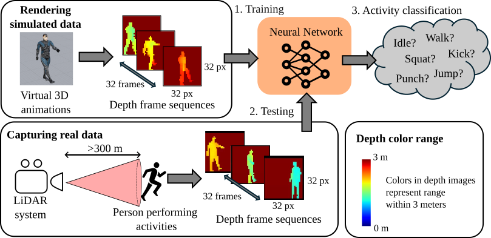

# Human Activity Recognition with Single-Photon LiDAR
This repository results of Human Activity Recognition performed on depth frames captured by a 32*32 pixel Single-Photon LiDAR array operating at 1550 nm. The data contains 6 activities by two real actors recorded during daylight at 325 meter range at Heriot-Watt University.
We have trained a recurrent neural network using ~100.000 short (32 frame) depth sequences of simulated human motion. These were sythetized from real motion data captured by a motion capture suit mapped to different virtual character models from [Adobe Mixamo](https://www.mixamo.com/). The network classifies a 32 frame input depth video sequence and outputs a confidence value per activity, that is visualized in the videos.

This work has been submitted to Optics Express under the title: "Human Activity Recognition at Kilometer Range using Single-Photon LiDAR", and is currently under review. This page will be updated when the work gets published.

The videos below shows the output of the train network on the real 325 m data where the 2 actors perform walk, followed by a mix of activities.

https://github.com/user-attachments/assets/7b4697f0-e125-4ae5-aab7-d5dd942e6489

https://github.com/user-attachments/assets/4b68ff83-cab3-4742-9f0a-46ab429c468b

